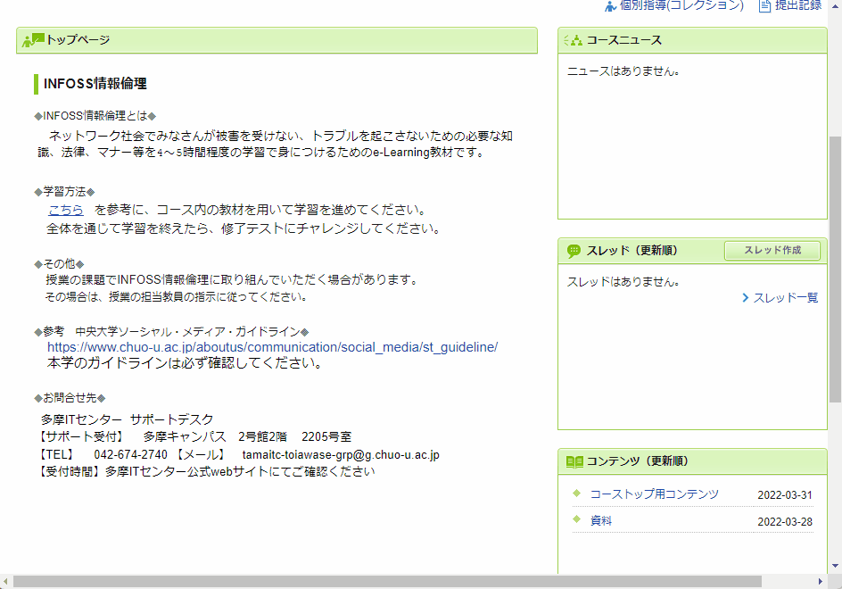
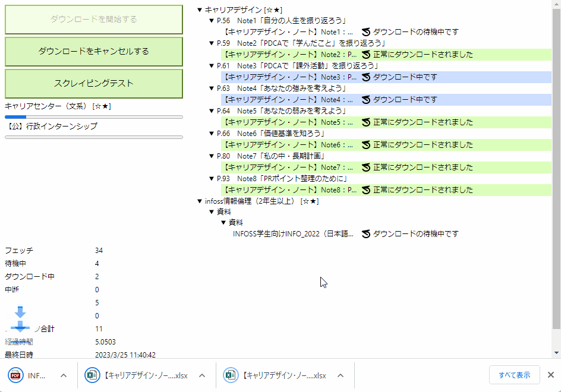
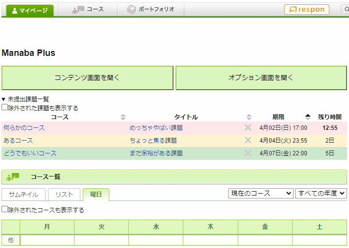
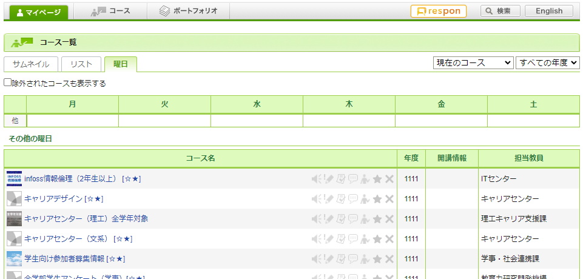
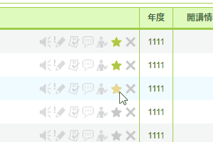

# ⭐️機能紹介⭐️

## 課題提出でファイルをドラッグアンドドロップしたいと思ったそこのあなた！！

Manaba Plusならできます！！

## タイムアウトしたからってログイン画面に移ってくれない中大SSOにキレ散らかしているそこのあなた！！

Manaba Plusは中大SSOのタイムアウト画面にmanabaへのボタンを追加します！！

## 外部リンクをクリックしたらそのままリンク先に移動してくれると思っていたそこのあなた！！

Manaba Plusはmanabaの外部リンクを確認バルーンを表示させずに開けるようにします！！

## いちいちページを移動してファイルをダウンロードするのが面倒くさいと思っているそこのあなた！！

Manaba Plusはmanaba上のPDFなどの添付ファイルをコースごとにフォルダ分けして一括ダウンロードすることができます！！

## 成績タブのレポートの成績には「回答の確認」リンクがなくておかしいなと思ったそこのあなた！！

Manaba Plusがmanabaのレポートの提出画面へのリンクを貼ります！！

## 課題を溜めがちなそこのあなた！！

Manaba Plusはmanaba上の課題を締め切り順で一覧表示することができます！！

## シンプル派なそこのあなた！！

Manaba Plusはmanabaのホーム画面のレイアウトを変更することで必要最低限のことだけ表示することができます！！

## 「使わないコース」なんて表示しなければいいのにと思っているそこのあなた！！

Manaba Plusはmanabaのホーム画面のコースを非表示にすることができます！！

## ⭐をつけたいそこのあなた！！

Manaba Plusはmanabaのホーム画面の⭐を再読み込みせずに付けたり外したりできます！！

## 急に課題が気になりだすそこのあなた！！

Manaba Plusはmanabaの未提出課題一覧をブラウザの拡張機能アイコンから確認できるようにします！！

## 資料のダウンロードを忘れてしまうそこのあなた！！

Manaba Plusは最後のコンテンツのダウンロードから一定時間が経過すると通知を行います！！

## 筑波だけではありません！！

Manaba Plusは筑波大学のmanabaだけでなく、[多くの大学](https://github.com/HotariTobu/manaba-plus/blob/master/host-list.md)に対応しています！！

## Chromeだけではありません！！

Manaba Plusはあらゆるブラウザに対応する拡張機能を目指しており、現在はChrome、Edge、Firefoxに対応しています。